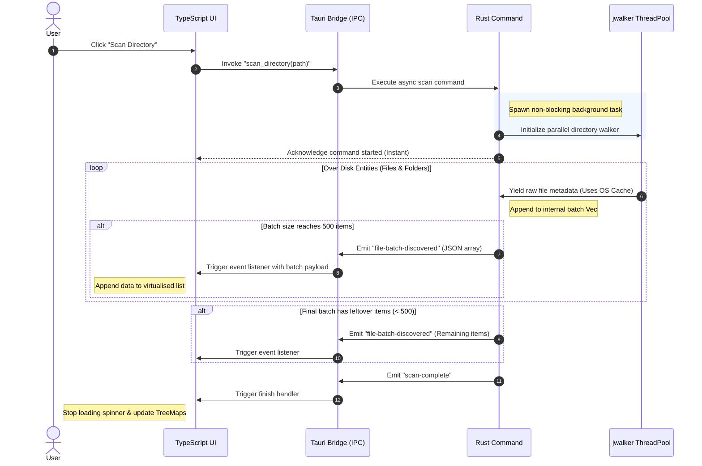

```mermaid
sequenceDiagram
    autonumber
    actor User
    participant TS as TypeScript UI
    participant Tauri as Tauri Bridge (IPC)
    participant Rust as Rust Command
    participant JW as jwalker ThreadPool

    User->>TS: Click "Scan Directory"
    TS->>Tauri: Invoke "scan_directory(path)"
    Tauri->>Rust: Execute async scan command
    
    rect rgb(240, 248, 255)
        note right of Rust: Spawn non-blocking background task
        Rust->>JW: Initialize parallel directory walker
    end

    Rust-->>TS: Acknowledge command started (Instant)

    loop Over Disk Entities (Files & Folders)
        JW->>Rust: Yield raw file metadata (Uses OS Cache)
        note right of Rust: Append to internal batch Vec
        
        alt Batch size reaches 500 items
            Rust->>Tauri: Emit "file-batch-discovered" (JSON array)
            Tauri->>TS: Trigger event listener with batch payload
            note left of TS: Append data to virtualised list
        end
    end

    alt Final batch has leftover items (< 500)
        Rust->>Tauri: Emit "file-batch-discovered" (Remaining items)
        Tauri->>TS: Trigger event listener
    end

    Rust->>Tauri: Emit "scan-complete"
    Tauri->>TS: Trigger finish handler
    note left of TS: Stop loading spinner & update TreeMaps

```
